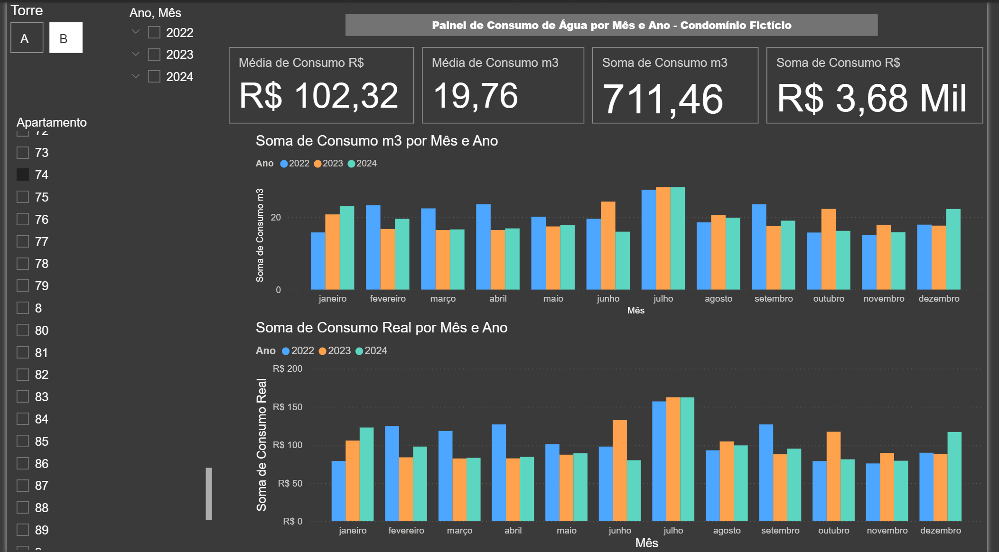

# 💧 Dashboard de Consumo de Água para Condomínios

Painel interativo criado para gestão e análise do consumo de água em um condomínio com 2 torres e 300 apartamentos, utilizando dados simulados com base em experiência real de gestão condominial.

---

## 📌 Objetivo

Oferecer um dashboard que auxilie:

- Síndicos e gestores a **identificar padrões de consumo**
- Detectar **sazonalidades ou possíveis vazamentos**
- Responder dúvidas de moradores com **dados visuais e objetivos**
- Criar alertas proativos com base em **comportamentos atípicos**
- Gerar campanhas de conscientização baseadas em dados

---

## 🛠️ Tecnologias Utilizadas

- Power BI (Power Query, DAX, Visualizações)
- Geração de dados simulados com IA (baseados em contexto real)
- CSV como fonte de dados

---

## 📸 Preview do Dashboard

> *Imagem salva na pasta `/assets`*

<p align="center">
  
</p>

---

## 📊 Destaques do Projeto

- **Dashboard interativo** com filtros por torre, apartamento, data
- Visualização do consumo **mês a mês por ano**
- Cartões de destaque: média de consumo (R$ e m3), gasto em R$, consumo em m3
- Gráficos comparativos para identificar **padrões de sazonalidade**
- Design limpo e com foco em **storytelling visual**

---

## 📁 Estrutura do Projeto

```bash
consumo-agua-condominio/
│
├── dashboard.pbix ← Arquivo principal do Power BI
│
│
├── 📂 dados/
│ ├── consumo_agua_condominio_2022_2024.csv ← Dados simulados baseados na realidade
│
│
├── 📂 assets/
│ ├── evidência-chatGPT.png ← Print do chatGPT gerando o csv utilizado como fonte de dados
│ └── print-dash.png ← Print do dashboard
│
├── 📄 README.md ← Este arquivo
```
---

## 🔍 Insights Possíveis

- **Sazonalidade**: Julho apresenta aumento de consumo em certos apartamentos, indicando padrões relacionados a férias escolares e maior permanência de pessoas em casa.
- **Campanhas preventivas**: É possível identificar os períodos e torres com consumo elevado e usar os dados para campanhas de conscientização.
- **Comparação entre torres**: A média de consumo entre Torre A e B pode apontar diferenças estruturais ou comportamentais dos moradores.
- **Respostas rápidas a moradores**: Com poucos cliques, é possível mostrar se o consumo de um morador está dentro do padrão ou não.
- **Facilidade para auditorias internas**: Identificação visual de picos e tendências que antes exigiriam esforço manual em Excel.
- **Justificativa do aumento**: É possível identificar facilmente, em casos de aumento, se o aumento foi de fato no consumo ou apenas em R$ (o que representaria mudança de bandeira, aumento na taxa, etc) 

---

## 🧠 Aprendizados e Impacto

Este foi meu primeiro projeto completo de BI, desde a **geração de dados**, até a **criação do dashboard e insights de negócio**, unindo:
- Experiência profissional real (gestão condominial)
- Técnicas de visualização de dados
- Lógica de análise e raciocínio crítico
> Este projeto foi desenvolvido logo nos meus primeiros contatos com o Power BI. Desde o início, meu foco foi criar algo prático, relevante e aplicável a um cenário real de negócio.  
> A ideia surgiu a partir da minha vivência em gestão condominial, onde o controle era feito apenas em Excel. Com isso, utilizei ferramentas mais robustas para gerar valor, melhorar a visualização dos dados e apoiar a tomada de decisão. 

---

## 📈 Próximos Passos

- Criar uma segunda versão no futuro com múltiplas abas: visão geral, alertas e análise aprofundada - Análises proativas, automações etc

---

## 🔗 Link para o `.pbix` e arquivos

📁 [`/dashboard.pbix`](./dashboard.pbix)

---

## 🧑‍💻 Autor

**Ian Ramos**  
[LinkedIn](https://linkedin.com/in/ian-ramos-) • [GitHub](https://github.com/Ian-Ramoss)

<p align="center">
  Feito com 💡 dados, ☕ café e muita curiosidade.
</p>

---
