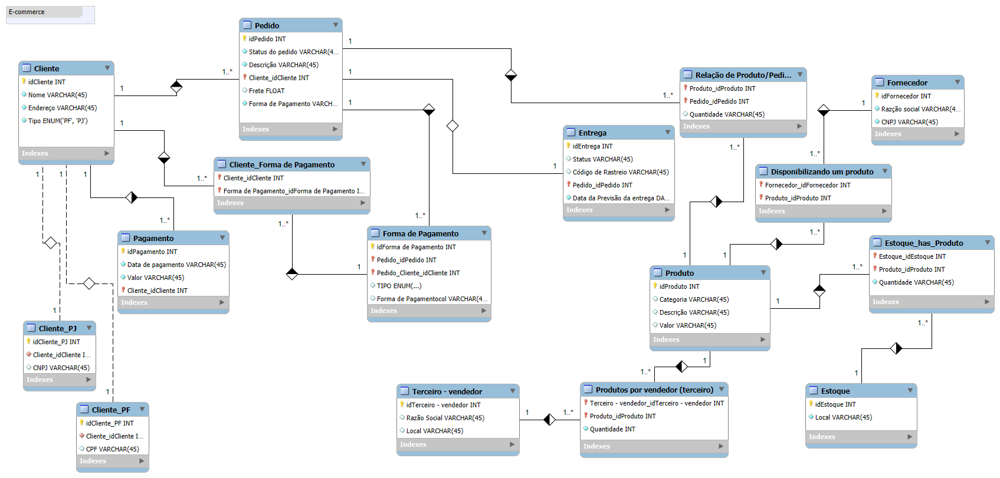

# Modelagem de Dados para E-commerce

Este projeto consiste na modelagem de dados de um sistema de e-commerce, utilizando o **MySQL Workbench** para criar um diagrama **EER** (Enhanced Entity-Relationship). O objetivo é representar as entidades, atributos e relacionamentos necessários para um sistema de vendas online.

## IMAGEM:

## Entidades e Atributos

### Cliente
- **idCliente** (INT) - Identificador
- **Nome** (VARCHAR) - Nome do cliente
- **Endereço** (VARCHAR) - Endereço do cliente
- **Tipo** (ENUM) - Tipo de cliente ("PF" ou "PJ")

### Cliente_PF
- **idCliente_PF** (INT)
- **Cliente_idCliente** (INT) - FK para tabela Cliente
- **CPF** (VARCHAR) - CPF do cliente pessoa física

### Cliente_PJ
- **idCliente_PJ** (INT)
- **Cliente_idCliente** (INT) - FK para tabela Cliente
- **CNPJ** (VARCHAR) - CNPJ do cliente pessoa jurídica

### Pedido
- **idPedido** (INT) - Identificador do pedido
- **Status do pedido** (VARCHAR)
- **Descrição** (VARCHAR)
- **Cliente_idCliente** (INT) - FK para tabela Cliente
- **Frete** (FLOAT)
- **Forma de Pagamento** (VARCHAR)

### Pagamento
- **idPagamento** (INT)
- **Data de pagamento** (VARCHAR)
- **Valor** (VARCHAR)
- **Cliente_idCliente** (INT) - FK para tabela Cliente

### Forma de Pagamento
- **idForma de Pagamento** (INT)
- **Pedido_idPedido** (INT) - FK para tabela Pedido
- **Pedido_Cliente_idCliente** (INT) - FK para tabela Cliente
- **TIPO** (ENUM)
- **Forma de Pagamento Tool** (VARCHAR)

### Entrega
- **idEntrega** (INT)
- **Status** (VARCHAR)
- **Código de Rastreio** (VARCHAR)
- **Pedido_idPedido** (INT) - FK para tabela Pedido
- **Data da Previsão da Entrega** (DATA)

### Produto
- **idProduto** (INT)
- **Categoria** (VARCHAR)
- **Descrição** (VARCHAR)
- **Valor** (VARCHAR)

### Fornecedor
- **idFornecedor** (INT)
- **Razão Social** (VARCHAR)
- **CNPJ** (VARCHAR)

### Estoque
- **idEstoque** (INT)
- **Local** (VARCHAR)

### Terceiro - Vendedor
- **idTerceiro - Vendedor** (INT)
- **Razão Social** (VARCHAR)
- **Local** (VARCHAR)

### Tabelas de Relacionamento
- **Cliente_Forma de Pagamento**
- **Relação de Produto/Pedido**
- **Disponibilizando um Produto**
- **Estoque_has_Produto**
- **Produtos por Vendedor (Terceiro)**

## Relacionamentos
- Um **Cliente** pode realizar vários **Pedidos**.
- Um **Pedido** pode conter vários **Produtos**.
- Um **Produto** pode estar relacionado a vários **Fornecedores**.
- A tabela **Cliente_Forma de Pagamento** relaciona **Clientes** com suas **Formas de Pagamento**.
- A tabela **Relação de Produto/Pedido** associa **Produtos** com seus **Pedidos** correspondentes.
- A tabela **Disponibilizando um Produto** conecta **Fornecedores** com os **Produtos** fornecidos.
- A tabela **Estoque_has_Produto** relaciona o **Estoque** com os **Produtos** armazenados.
- A tabela **Produtos por Vendedor (Terceiro)** vincula produtos a terceiros que realizam vendas.

## Diagrama EER

O diagrama **EER** foi criado no **MySQL Workbench** e está disponível no arquivo [`ecommerce.mwb`](./ecommerce.mwb). Ele representa visualmente as entidades, atributos e relacionamentos descritos acima.

## Tecnologias Utilizadas

- **MySQL Workbench:** Para modelagem do banco de dados e criação do diagrama EER.

## Autor
- [Ian Ramos](www.linkedin.com/in/ian-ramos-)
- [GitHub](https://github.com/Ian-Ramoss)

