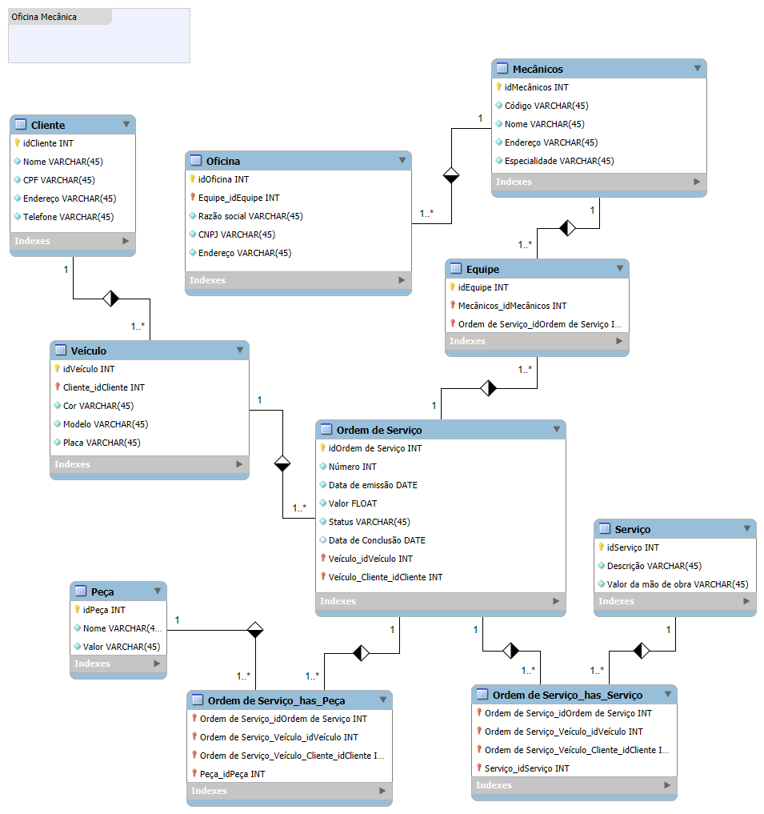

# 📋 Sistema de Controle de Ordem de Serviço - Oficina Mecânica

Este projeto apresenta um esquema conceitual para um sistema de controle e gerenciamento de ordens de serviço em uma oficina mecânica, seguindo a narrativa e os requisitos do desafio proposto.

---

## IMAGEM:

---

## 🗂️ Entidades e Atributos

### **Cliente**
- `idCliente` (PK)
- `Nome`
- `CPF`
- `Endereço`
- `Telefone`

### **Veículo**
- `idVeículo` (PK)
- `idCliente` (FK)
- `Cor`
- `Modelo`
- `Placa`

### **Oficina**
- `idOficina` (PK)
- `Razão Social`
- `CNPJ`
- `Endereço`
- `Telefone`
- `E-mail`

### **Mecânico**
- `idMecânico` (PK)
- `Código`
- `Nome`
- `Endereço`
- `Especialidade`

### **Equipe**
- `idEquipe` (PK)
- `idMecânico` (FK)
- `idOrdem de Serviço` (FK)

### **Ordem de Serviço**
- `idOrdem de Serviço` (PK)
- `Número`
- `Data de Emissão`
- `Valor`
- `Status`
- `Data de Conclusão`
- `idVeículo` (FK)
- `idCliente` (FK)

### **Serviço**
- `idServiço` (PK)
- `Descrição`
- `Valor da Mão de Obra`

### **Peça**
- `idPeça` (PK)
- `Nome`
- `Valor`

### **Ordem de Serviço_has_Peça** (Relacionamento Associativo)
- `idOrdem de Serviço` (FK)
- `idVeículo` (FK)
- `idCliente` (FK)
- `idPeça` (FK)

### **Ordem de Serviço_has_Serviço** (Relacionamento Associativo)
- `idOrdem de Serviço` (FK)
- `idVeículo` (FK)
- `idCliente` (FK)
- `idServiço` (FK)

---

## 🔗 Relacionamentos
✅ **Cliente** 1 : N **Veículo**  
✅ **Veículo** 1 : N **Ordem de Serviço**  
✅ **Ordem de Serviço** 1 : N **Equipe**  
✅ **Equipe** N : 1 **Mecânico**  
✅ **Mecânico** N : 1 **Oficina**  
✅ **Ordem de Serviço** N : M **Peça** (via entidade associativa `Ordem de Serviço_has_Peça`)  
✅ **Ordem de Serviço** N : M **Serviço** (via entidade associativa `Ordem de Serviço_has_Serviço`)  

---

## 🚀 Instruções para Utilização
1. Importe o arquivo `.mwb` no MySQL Workbench para visualizar o diagrama (ou visualize pelo `.png` ;) ).

---

## Autor
- [Ian Ramos](www.linkedin.com/in/ian-ramos-)
- [GitHub](https://github.com/Ian-Ramoss)

